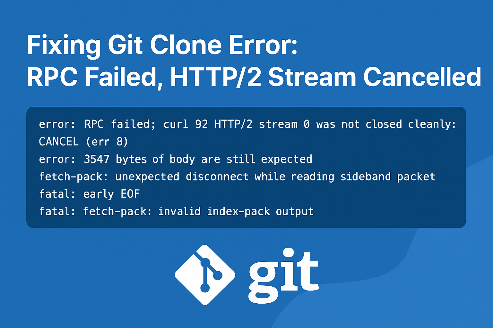

In this post, I’ll show you how to fix the frustrating `RPC failed; curl 92 HTTP/2 stream 0 was not closed cleanly: CANCEL (err 8)` error that can occur when cloning large Git repositories. If you've encountered this error, you're not alone! Let's dive into the causes and solutions.

<!-- truncate -->



## Introduction

The other day, I was trying to clone my GitHub repository, but I ran into a frustrating error.  
If you’ve ever seen something like this, you know how annoying it feels:

```bash
error: RPC failed; curl 92 HTTP/2 stream 0 was not closed cleanly: CANCEL (err 8)
error: 3547 bytes of body are still expected
fetch-pack: unexpected disconnect while reading sideband packet
fatal: early EOF
fatal: fetch-pack: invalid index-pack output
````

At first, I thought something was wrong with my Git setup. But after digging in, I realized the problem was with **large repository size, network limits, and Git’s default settings**.  

In this blog, I’ll break down **why this happens** and the **step-by-step solutions** I tried to fix it.

---

## Why This Error Happens  

This error usually shows up when:  
- Your repository is **very large** (hundreds of MBs or more).  
- Git’s default **HTTP buffer size is too small**.  
- The repo has **too many objects (commits, files, branches, blobs)**.
- Network interruptions cause Git to cancel the fetch.  

Basically, Git starts downloading your repo, but before finishing, the connection breaks — and Git doesn’t know what to do with the incomplete data.

---

## Solutions That Worked  

Here are the methods I tried to fix it:

### 1. Increase Git Buffer Size  
Git’s default HTTP buffer is small. Let’s make it bigger:  

```bash
git config --global http.postBuffer 524288000
git config --global http.maxRequests 100
git config --global http.version HTTP/1.1
```

This allows Git to handle bigger repositories without choking.

---

### 2. Use a Shallow Clone (Fastest Fix)

If you only need the latest commit (not the full history):

```bash
git clone --depth=1 https://github.com/ajay-dhangar/ajay-dhangar.github.io.git
```

👉 This grabs the newest version quickly.
If you later need full history:

```bash
cd ajay-dhangar.github.io
git fetch --unshallow
```

This way, you start small and expand as needed.

---

### 3. Clone Only One Branch

If the repo has multiple branches, but you just want `main`:

```bash
git clone --single-branch --branch main https://github.com/ajay-dhangar/ajay-dhangar.github.io.git
```

This avoids fetching unnecessary data.

---

### 4. Switch to SSH

Sometimes HTTPS causes issues. If you have SSH keys set up:

```bash
git clone git@github.com:ajay-dhangar/ajay-dhangar.github.io.git
```

This is often more reliable for big repos.

---

### 5. Sparse Checkout (Download Only What You Need)

If you don’t need the whole repo, just a folder:

```bash
git clone --filter=blob:none https://github.com/ajay-dhangar/ajay-dhangar.github.io.git
cd ajay-dhangar.github.io
git sparse-checkout init --cone
git sparse-checkout set <folder-you-need>
```

This keeps your local clone lightweight.

---

### 6. Use Git LFS for Large Files

If your repo has big media files, install [Git LFS](https://git-lfs.com/):

```bash
git lfs install
git lfs clone https://github.com/ajay-dhangar/ajay-dhangar.github.io.git
```

This prevents huge files from breaking your clone process.

---

## Final Takeaway

If you’re facing the `RPC failed; curl 92 HTTP/2` error:

* Start with **`--depth=1`** (quickest fix).
* If you need full history, increase the buffer size.
* For big repos with assets, use **Git LFS or sparse checkout**.

These tricks saved me hours of frustration, and I hope they help you too.